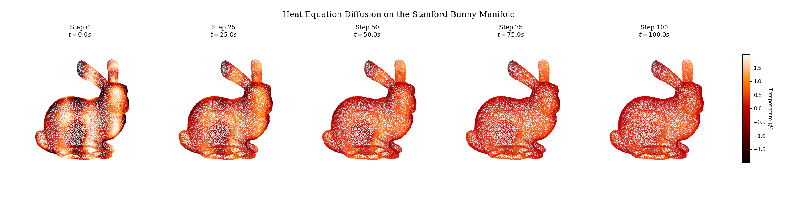
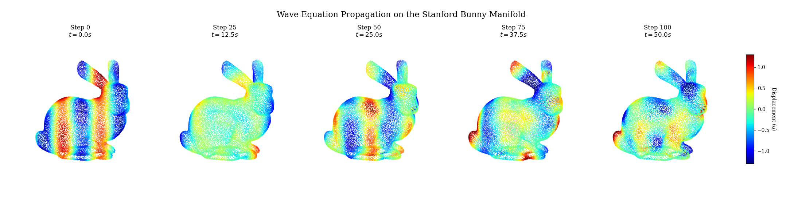

# PyDiffold :earth_americas:
`PyDiffold` is a Python library for `differential geometry`. It provides tools for approximating `local differential structure`, as well as discrete `differential operators`.

The library is designed to facilitate numerical experimentation in geometry processing and geometric PDEs by operating directly on sampled surfaces, without requiring explicit mesh connectivity.

### PyDiffold for Partial Differential Equations
The `Laplace–Beltrami operator` was computed on the vertices of the Stanford Bunny, without relying on mesh connectivity. Based on this operator, the heat equation and the wave equation were solved on the surface of the model.





## Local differential structure
The `Manifold` class computes and stores the following differential geometry entities for each sample point $i$:

* **`points`**: Coordinates in ambient 3D space $(x, y, z)$.
* **`local_coordinates`**: 2D coordinates $(u, v)$ in the local tangent plane, representing the mapping by a chart $\phi$.
* **`normal_vectors`**: Normalized unit normal vector $\vec{n}$ at each point.
* **`tangent_vectors`**: Basis vectors $\{r_u, r_v\}$ spanning the tangent space $T_pM$ in ambient coordinates.
* **`metric_tensor`**: The metric tensor $g_{\mu\nu}$ (First Fundamental Form) at each point.
* **`metric_tensor_inv`**: The inverse metric tensor $g^{\mu\nu}$ at each point.
* **`metric_tensor_derivatives`**: Partial derivatives of the metric tensor $\partial_\alpha g_{\mu\nu}$ (where $\alpha \in \{u, v\}$).
* **`christoffel_symbols`**: Christoffel Symbols of the second kind $\Gamma^\sigma_{\mu\nu}$, defining the Levi-Civita connection.
* **`gaussian_curvature`**: The intrinsic Gaussian curvature $K$ at each point.
* **`scalar_curvature`**: The scalar curvature $R$, which for 2D manifolds is $2K$.
* **`ricci_curvature_tensor`**: The Ricci curvature tensor, defined as $R_{\mu\nu} = K g_{\mu\nu}$.
* **`riemann_curvature_tensor`**: The Riemann curvature tensor $R_{\mu\nu\sigma\rho}$, where the non-zero components are determined by $K$ and the metric determinant $\det(g)$.

### 🚀 Usage Example: Accessing Manifold Properties

Once the `Manifold` is initialized, all geometric tensors are precomputed and stored as NumPy arrays. Here is how to access them:

```python
import numpy as np
from pydiffold.manifold import Manifold

# 1. Initialize the manifold with a point cloud (N, 3)
points = np.random.rand(100, 3)
manifold = Manifold(points, k=12)

# 2. Access Geometric Basis & Coordinates
p_ambient = manifold.points[i]
p_local   = manifold.local_coordinates[i]
normal    = manifold.normal_vectors[i]
tangents  = manifold.tangent_vectors[i]

# 3. Access Metric Tensors
g         = manifold.metric_tensor[i]
g_inv     = manifold.metric_tensor_inv[i]
dg        = manifold.metric_tensor_derivatives[i]

# 4. Access Connection & Curvature
gamma     = manifold.christoffel_symbols[i]
K         = manifold.gaussian_curvature[i]
R_scalar  = manifold.scalar_curvature[i]
ricci     = manifold.ricci_curvature_tensor[i]
riemann   = manifold.riemann_curvature_tensor[i]

# 5. Geodesic Path Computation
geodesic, arc_length = manifold.geodesic(0, 2000)
geodesic_coords: np.array = manifold.points[geodesic]
```

## Differential operators
The `ScalarField` class represents a scalar function $f: M \to \mathbb{R}$ defined over the manifold. It provides discrete approximations of differential operators based on the local neighborhood of each point:

* **`gradient`**: A discrete representation of the surface gradient $\nabla_M f$. Since it is defined over the edges of the connectivity graph, it is returned as a list of arrays where each element contains the variation of the field along the edges connected to point $i$.
* **`gradient_norm`**: An approximation of the gradient magnitude $\|\nabla_M f\|$ at each point, computed via the local Dirichlet energy.
* **`laplacian`**: An approximation of the Laplace-Beltrami operator $\Delta_M f$ at each point, using a weighted graph Laplacian formulation.

### 📈 Usage Example: Scalar Field Operations

The `ScalarField` class allows you to define a field (like temperature or pressure) over the manifold and compute its differential operators:

```python
import numpy as np

from pydiffold.manifold import Manifold
from pydiffold.field import ScalarField

# 1. Define Manifold
points = np.random.rand(100, 3)
manifold = Manifold(points, k=12)

# 2. Define scalar field
values = np.sum(manifold.points, axis=1)
field = ScalarField(manifold, values)

# 3. Differential operators
grad = field.gradient 
norm = field.gradient_norm 
lap = field.laplacian
```

## TODO
* Vector and Tensor fields
* Covariant Derivative
* Higher dimensions manifolds

## Contributing
Please feel free to submit issues or pull requests.

## Dependencies
* [NumPy](https://github.com/numpy/numpy)
* [SciPy](https://github.com/scipy/scipy)
* [NetworkX](https://github.com/networkx/networkx)
* [Matplotlib](https://github.com/matplotlib/matplotlib)