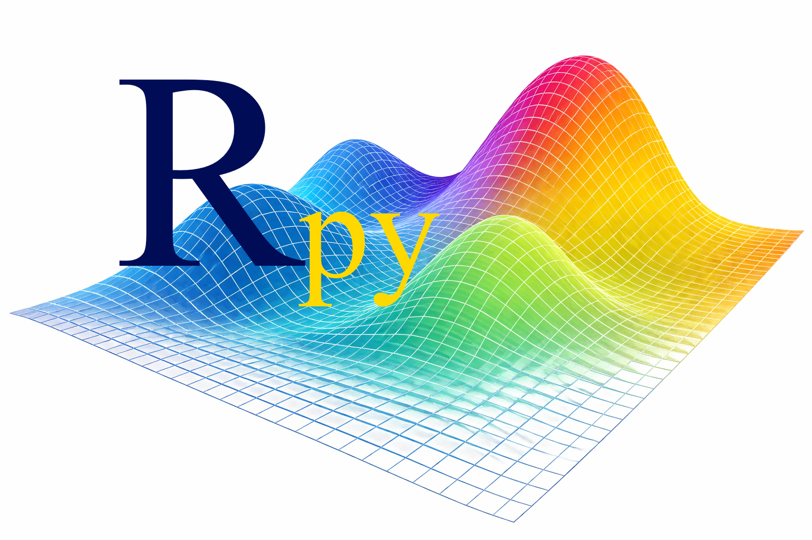
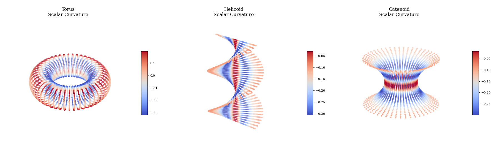
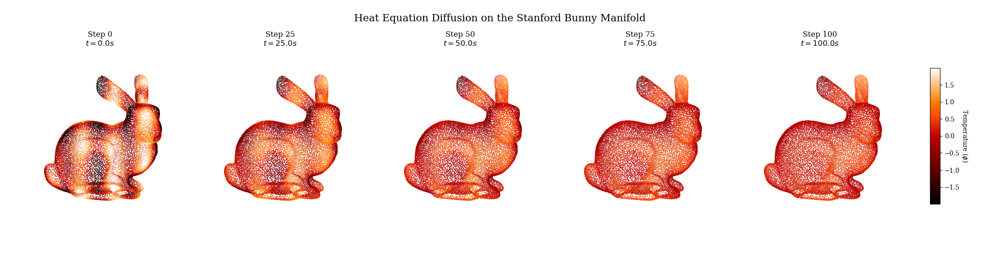
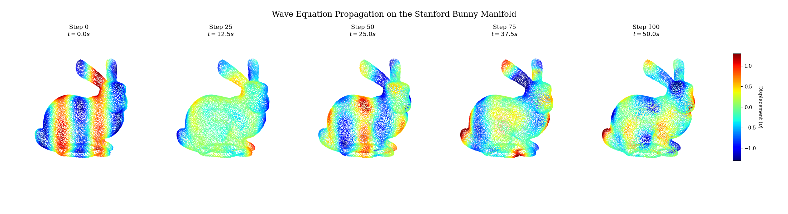

# RiemannPy

<p align="center">
    
</p>

`RiemannPy` is a Python library for `Differential Geometry`, more specifically `Riemannian Geometry`. It provides tools for approximating `local differential structure`, as well as discrete `differential operators`.

The library is designed to facilitate numerical experimentation in geometry processing and geometric PDEs by operating directly on sampled surfaces, without requiring explicit mesh connectivity.

### RiemannPy for computing the curvature of a sampled surface
The `scalar curvature` was derived by computing the gaussian curvature from the first and second fundamental forms of local fitted paraboloids.


### RiemannPy for Partial Differential Equations
The `Laplace–Beltrami operator` was computed on the vertices of the Stanford Bunny, without relying on mesh connectivity. Based on this operator, the heat equation and the wave equation were solved on the surface of the model.





## Local differential structure
The `Manifold` class computes and stores the following differential geometry entities for each sample point $i$:

* **`points`**: Coordinates in ambient 3D space $(x, y, z)$.
* **`local_coordinates`**: 2D coordinates $(u, v)$ in the local tangent plane, representing the mapping by a chart $\phi$.
* **`normal_vectors`**: Normalized unit normal vector $\vec{n}$ at each point.
* **`tangent_vectors`**: Basis vectors $\{r_u, r_v\}$ spanning the tangent space $T_pM$ in ambient coordinates.
* **`metric_tensor`**: The metric tensor $g_{\mu\nu}$ (First Fundamental Form) at each point.
* **`metric_tensor_inv`**: The inverse metric tensor $g^{\mu\nu}$ at each point.
* **`metric_tensor_derivatives`**: Partial derivatives of the metric tensor $\partial_\alpha g_{\mu\nu}$ (where $\alpha \in \{u, v\}$).
* **`christoffel_symbols`**: Christoffel Symbols of the second kind $\Gamma^\sigma_{\mu\nu}$, defining the Levi-Civita connection.
* **`gaussian_curvature`**: The intrinsic Gaussian curvature $K$ at each point.
* **`scalar_curvature`**: The scalar curvature $R$, which for 2D manifolds is $2K$.
* **`ricci_curvature_tensor`**: The Ricci curvature tensor, defined as $R_{\mu\nu} = K g_{\mu\nu}$.
* **`riemann_curvature_tensor`**: The Riemann curvature tensor $R_{\mu\nu\sigma\rho}$, where the non-zero components are determined by $K$ and the metric determinant $\det(g)$.

It also allows computing the geodesic between two points.
* **`geodesic`:** Computes the geodesic and its arclength between two points.

### Usage Example: Accessing Manifold Properties

Once the `Manifold` is initialized, all geometric tensors are precomputed and stored as NumPy arrays. Here is how to access them:

```python
import numpy as np
from riemannpy.manifold import Manifold

# 1. Initialize the manifold with a point cloud (N, 3)
points    = np.random.rand(100, 3)
manifold  = Manifold(points, k=12)

# 2. Access Geometric Basis & Coordinates
p_ambient = manifold.points[i]
p_local   = manifold.local_coordinates[i]
normal    = manifold.normal_vectors[i]
tangents  = manifold.tangent_vectors[i]

# 3. Access Metric Tensors
g         = manifold.metric_tensor[i]
g_inv     = manifold.metric_tensor_inv[i]
dg        = manifold.metric_tensor_derivatives[i]

# 4. Access Connection & Curvature
gamma     = manifold.christoffel_symbols[i]
K         = manifold.gaussian_curvature[i]
R_scalar  = manifold.scalar_curvature[i]
ricci     = manifold.ricci_curvature_tensor[i]
riemann   = manifold.riemann_curvature_tensor[i]

# 5. Geodesic Path Computation
geodesic, arc_length = manifold.geodesic(0, 2000)
geodesic_coords: np.array = manifold.points[geodesic]
```

## Differential operators
The `ScalarField` class represents a scalar function $f: M \to \mathbb{R}$ defined over the manifold. It provides discrete approximations of differential operators based on the local neighborhood of each point:

* **`gradient`**: A discrete edge-based representation of the surface gradient $\nabla_{\mathcal{M}} f$. Instead of a single vector in $\mathbb{R}^n$, it is returned as a list of arrays where each entry $i$ contains the weighted differences $\sqrt{w_{ij}}(f_j - f_i)$ along the edges connected to point $i$.
* **`gradient_norm`**: An approximation of the gradient magnitude $\|\nabla_{\mathcal{M}} f\|$ at each point. It is computed as the square root of the local variation, providing a measure of the field's steepness on the manifold surface.
* **`dirichlet_energy`**: The local Dirichlet energy $E_D(f)_i = \|\nabla_{\mathcal{M}} f\|_i^2$. It quantifies the local "roughness" or variability of the scalar field. Higher values indicate sharp transitions or high-frequency components, while lower values indicate smoothness.
* **`laplacian`**: An approximation of the **Random Walk Graph Laplacian** $(L_{rw} = I - D^{-1}W)$. This operator represents the difference between the value at point $i$ and the weighted average of its neighbors, making it ideal for diffusion and smoothing processes.
* **`laplace_beltrami`**: A robust approximation of the **Symmetric Normalized Laplacian** $(L_{sym} = I - D^{-1/2}WD^{-1/2})$. This formulation is numerically stable and standard for spectral manifold analysis, ensuring consistency regardless of local point density.

### Usage Example: Scalar Field Operations

The `ScalarField` class allows you to define a field (like temperature or pressure) over the manifold and compute its differential operators:

```python
import numpy as np

from riemannpy.manifold import Manifold
from riemannpy.field import ScalarField

# 1. Define Manifold
points             = np.random.rand(100, 3)
manifold           = Manifold(points, k=12)

# 2. Define scalar field
values             = np.sum(manifold.points, axis=1)
field              = ScalarField(manifold, values)

# 3. Differential operators
gradient           = field.gradient 
gradient_norm      = field.gradient_norm
dirichlet_energy   = field.dirichlet_energy
laplacian          = field.laplacian
laplace_beltrami   = filed.laplace_beltrami
```

## TODO
* Vector and Tensor fields
* Covariant Derivative
* Higher dimensions manifolds

## Contributing
Please feel free to submit issues or pull requests.

## Dependencies
* [NumPy](https://github.com/numpy/numpy)
* [SciPy](https://github.com/scipy/scipy)
* [NetworkX](https://github.com/networkx/networkx)
* [Matplotlib](https://github.com/matplotlib/matplotlib)